# Домашнее задание к занятию «Prometheus. Часть 1» Шелухин Юрий  

Это задание для самостоятельной отработки навыков и не предполагает обратной связи от преподавателя. Его выполнение не влияет на завершение модуля. Но мы рекомендуем его выполнить, чтобы закрепить полученные знания.

### Цели задания

1. Научиться устанавливать Prometheus
2. Научиться устанавливать Node Exporter
3. Научиться подключать Node Exporter к серверу Prometheus
4. Научиться устанавливать Grafana и интегрировать с Prometheus

### Чеклист готовности к домашнему заданию
- [ ] Просмотрите в личном кабинете занятие "Система мониторинга Prometheus" 

---

### Задание 1
Установите Prometheus.

#### Процесс выполнения
1. Выполняя задание, сверяйтесь с процессом, отражённым в записи лекции
2. Создайте пользователя prometheus
3. Скачайте prometheus и в соответствии с лекцией разместите файлы в целевые директории
4. Создайте сервис как показано на уроке
5. Проверьте что prometheus запускается, останавливается, перезапускается и отображает статус с помощью systemctl

#### Требования к результату
- [ ] Прикрепите к файлу README.md скриншот systemctl status prometheus, где будет написано: prometheus.service — Prometheus Service Netology Lesson 9.4 — [Ваши ФИО]

---

## Решение 1

1-2.  Создадим  пользователя prometheus.   
sudo useradd --no-create-home --shell /bin/false prometheus (без домашней директории)
3. Скачаем prometheus  
wget https://github.com/prometheus/prometheus/releases/download/v2.53.4/prometheus-2.53.4.linux
-386.tar.gz  
извлекем архив  
~/Downloads$ tar vxf prometheus-2.53.4.linux-386.tar.gz  
создадим директории 
mkdir /etc/prometheus  
mkdir /var/lib/prometheus  
скопируем утилиты
cp ./prometheus-2.53.4.linux-386/prometheus /usr/local/bin  
cp ./prometheus-2.53.4.linux-386/promtool /usr/local/bin  
cp -R ./prometheus-2.53.4.linux-386/consoles/ /etc/prometheus/
cp -R ./prometheus-2.53.4.linux-386/console_libraries/ /etc/prometheus/
cp ./prometheus-2.53.4.linux-386/prometheus.yml /etc/prometheus/  
проверим
ls -l /etc/prometheus  
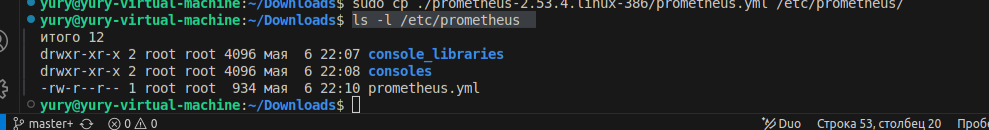  
передадим права на эти файлы пользователю prometheus
sudo chown -R prometheus:prometheus /etc/prometheus/ /var/lib/prometheus/  
sudo chown prometheus:prometheus /usr/local/bin/prometheus  
sudo chown prometheus:prometheus /usr/local/bin/promtool  

4. Запустим и проверим результат
sudo /usr/local/bin/prometheus --config.file /etc/prometheus/prometheus.yml --storage.tsdb.path /var/lib/prometheus/ --web.console.templates=/etc/prometheus/consoles --web.console.libraries=//etc/prometheus/console_libraries  
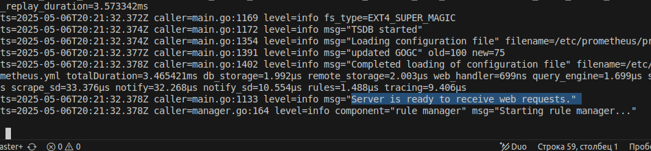  
Запустим в браузере адрес (ip a) с портом 9090  
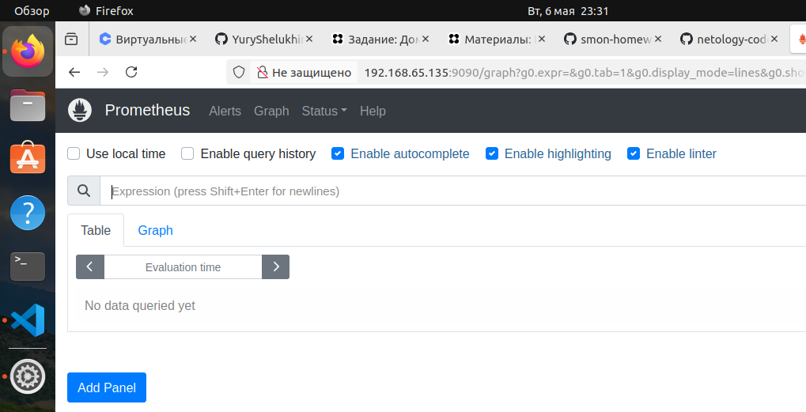  

5. Создадим сервис
vim /etc/systemd/system/prometheus.service  
sudo systemctl enable prometheus.service  
sudo systemctl start prometheus.service  
sudo systemctl status prometheus.service  
Не запустился, нет доступа. Проверим права.  
ls -l /usr/local/bin/prometheus  
ls -l /usr/local/bin/promtool  
ls -ld /var/lib/prometheus  
ls -ld /etc/prometheus/  
ls -l /etc/prometheus/  
директория и права принадлежат пользователю prometheus
При проверке ls -l /etc/prometheus/ выявим отсутствие таких прав.  
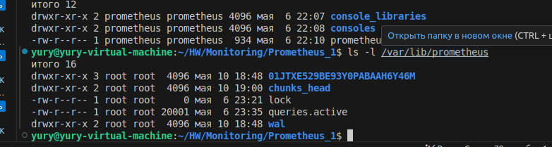  
Изменим права.   
sudo chown  -R prometheus:prometheus /var/lib/prometheus  
ok
запустим сервис. не запустился. порт занят. исправим
sudo lsof -i :9090  
sudo kill 46499
перезапустим сервис. проверим. ок
 

### Задание 2
Установите Node Exporter.

#### Процесс выполнения
1. Выполняя ДЗ сверяйтесь с процессом отражённым в записи лекции.
2. Скачайте node exporter приведённый в презентации и в соответствии с лекцией разместите файлы в целевые директории
3. Создайте сервис так как показано на уроке
4. Проверьте, что node exporter запускается, останавливается, перезапускается и отображает статус с помощью systemctl  

---

## Решение 2

1-2.  Скачаем node exporter  
wget https://github.com/prometheus/node_exporter/releases/download/v1.9.1/node_exporter-1.9.1.linux-386.tar.gz
извлекем архив  
~/Downloads$ tar vxf node_exporter-1.9.1.linux-386.tar.gz
Запустим
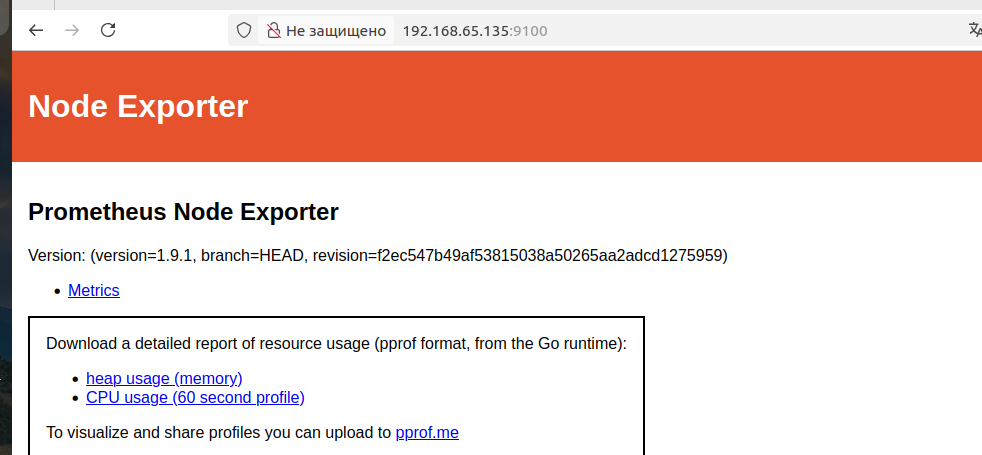  
Создадим директорию.   
sudo mkdir /etc/prometheus/node-exporter  
Cкопируем утилиту.  
sudo cp ./node_exporter /etc/prometheus/node-exporter 
Передадим права на этот файл пользователю prometheus.  
sudo chown -R prometheus:prometheus /etc/prometheus/node-exporter
3. Создадим сервис
vim /etc/systemd/system/node-exporter.service
sudo systemctl enable node-exporter.service  
sudo systemctl start node-exporter.service  
4. Проверим работу сервиса
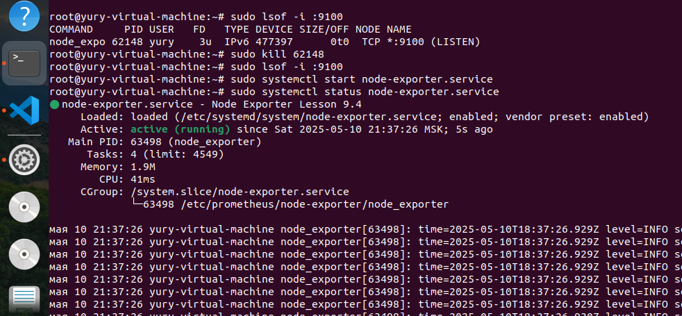 

---

### Задание 3
Подключите Node Exporter к серверу Prometheus.

#### Процесс выполнения
1. Выполняя ДЗ сверяйтесь с процессом отражённым в записи лекции.
2. Отредактируйте prometheus.yaml, добавив в массив таргетов установленный в задании 2 node exporter
3. Перезапустите prometheus
4. Проверьте что он запустился

#### Требования к результату
- [ ] Прикрепите к файлу README.md скриншот конфигурации из интерфейса Prometheus вкладки Status > Configuration
- [ ] Прикрепите к файлу README.md скриншот из интерфейса Prometheus вкладки Status > Targets, чтобы было видно минимум два эндпоинта

---

## Решение 3

1-2. Отредактируем файл /etc/prometheus/prometheus.yml  
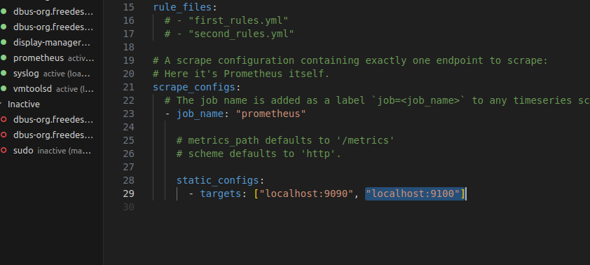   
3.Перезапустим prometheus  
sudo systemctl restart prometheus  
4. Проверим
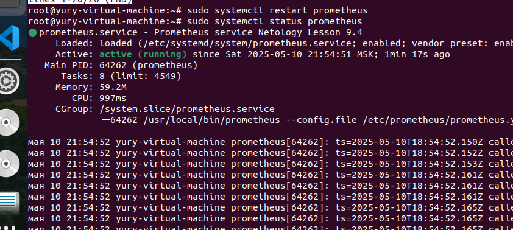  
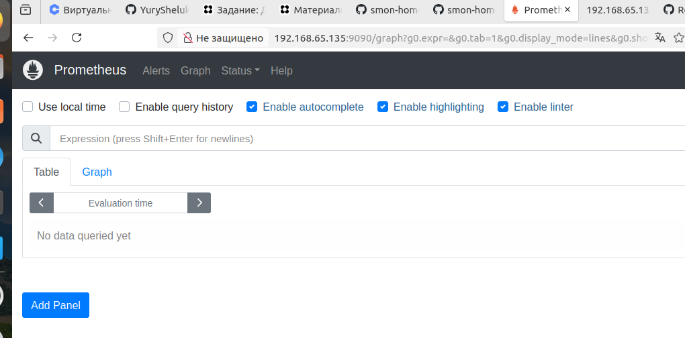  
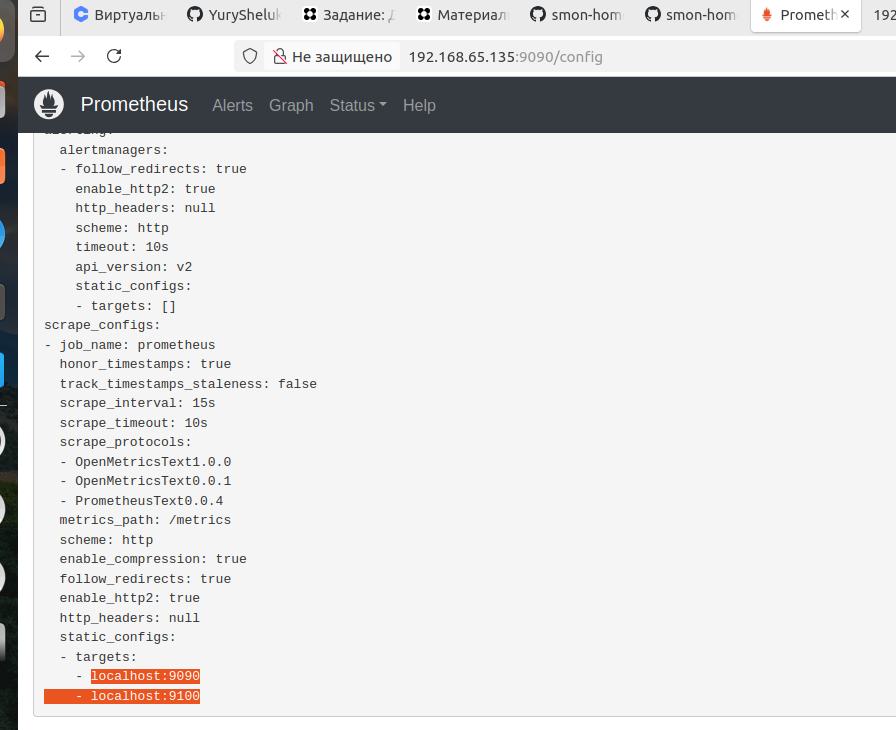  
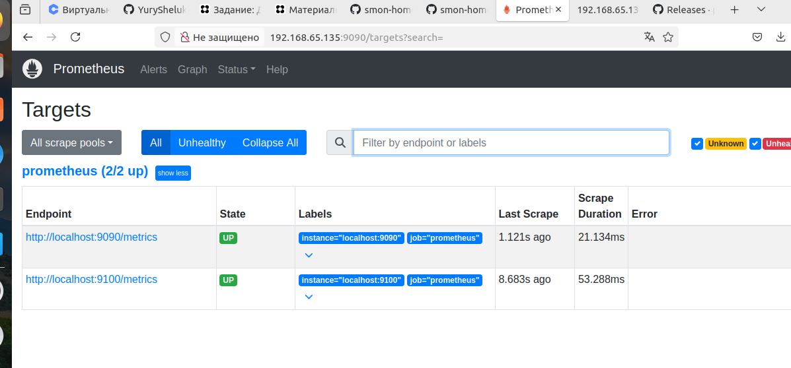

---

## Дополнительные задания со звёздочкой*
Эти задания дополнительные. Их можно не выполнять. Это не повлияет на зачёт. Вы можете их выполнить, если хотите глубже разобраться в материале.

---

### Задание 4*
Установите Grafana.

#### Требования к результату
- [ ] Прикрепите к файлу README.md скриншот левого нижнего угла интерфейса, чтобы при наведении на иконку пользователя были видны ваши ФИО  
  
---

## Решение 4*

Возьмем код на сайте Grafana.  
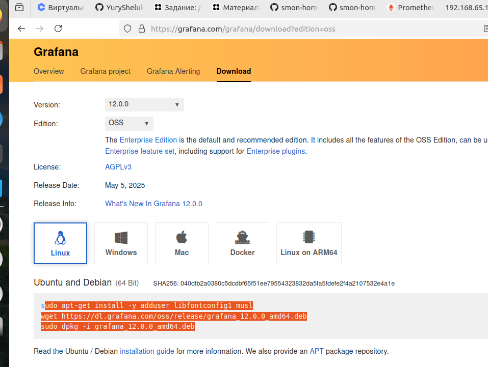
sudo apt-get install -y adduser libfontconfig1 musl  
wget https://dl.grafana.com/oss/release/grafana_12.0.0_amd64.deb  
sudo dpkg -i grafana_12.0.0_amd64.deb
Настроим сервис.
sudo systemctl enable grafana-server.service   
sudo systemctl start grafana-server.service
Обратимся к стадартному порту 3000 (admin/admin)
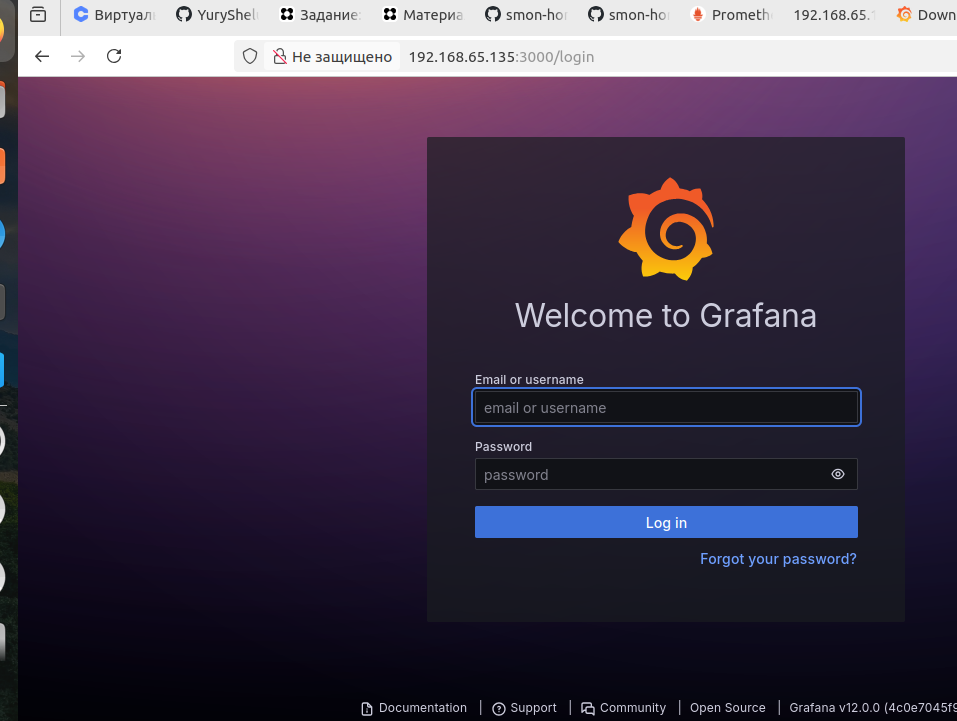
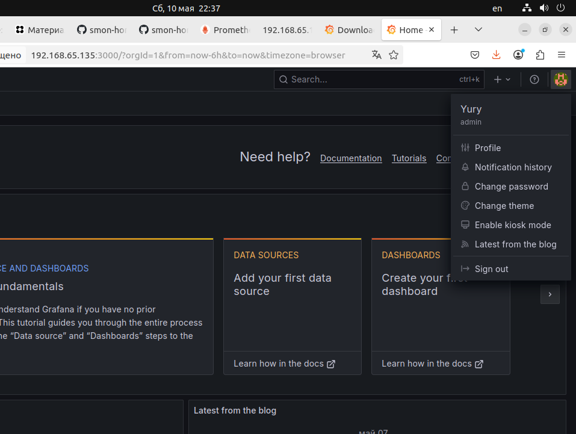

---

### Задание 5*
Интегрируйте Grafana и Prometheus.

---

## Решение 5*

Возьмем код на сайте Grafana.  
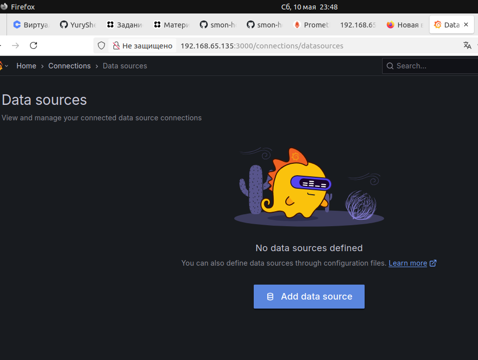
sudo apt-get install -y adduser libfontconfig1 musl  
wget https://dl.grafana.com/oss/release/grafana_12.0.0_amd64.deb  
sudo dpkg -i grafana_12.0.0_amd64.deb
Настроим сервис.
sudo systemctl enable grafana-server.service   
sudo systemctl start grafana-server.service
Обратимся к стадартному порту 3000 (admin/admin)
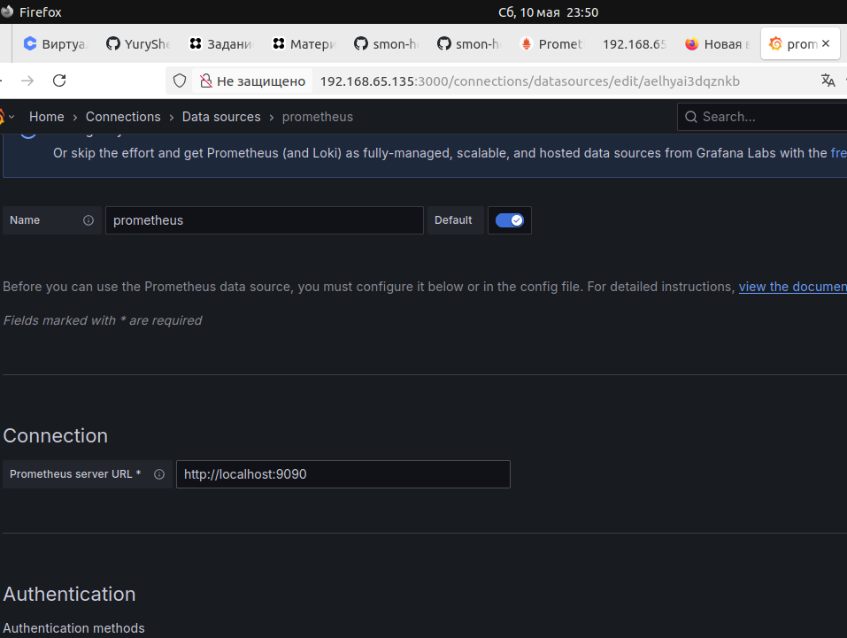
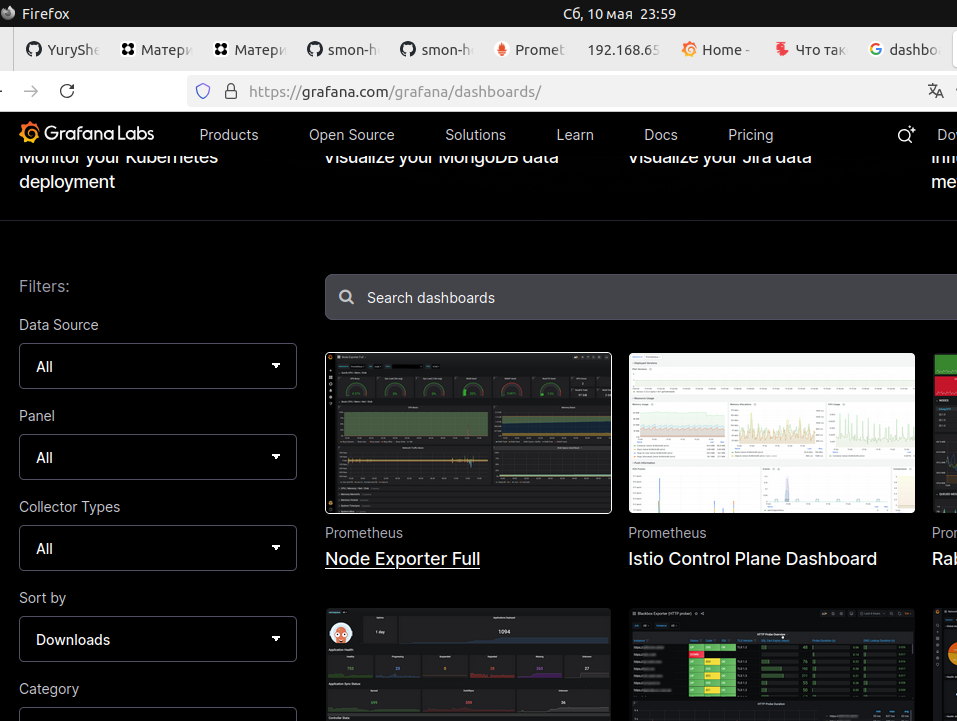  
---

